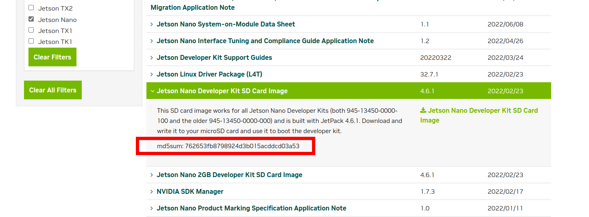
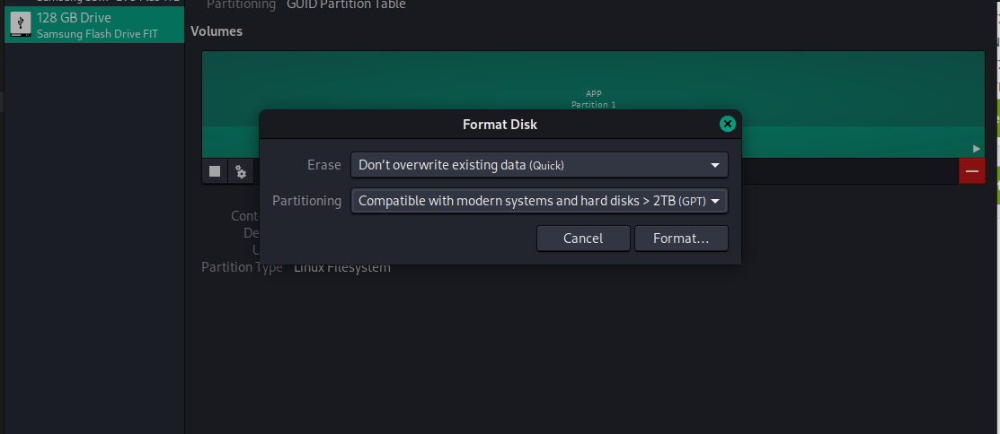
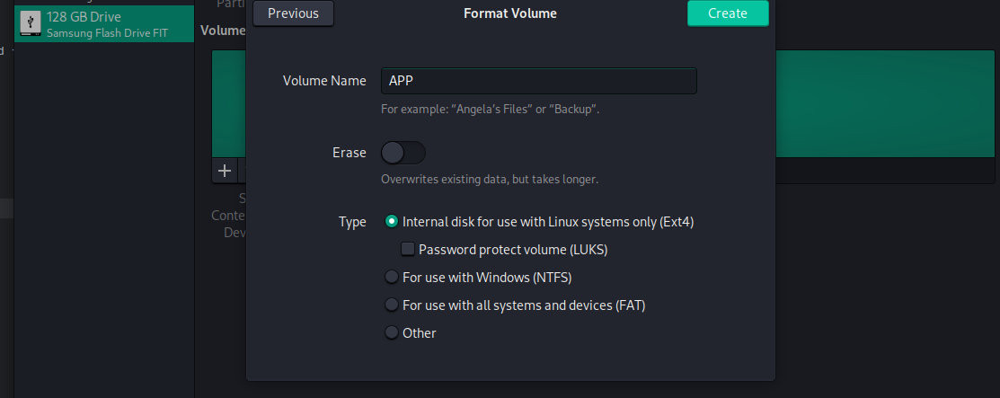
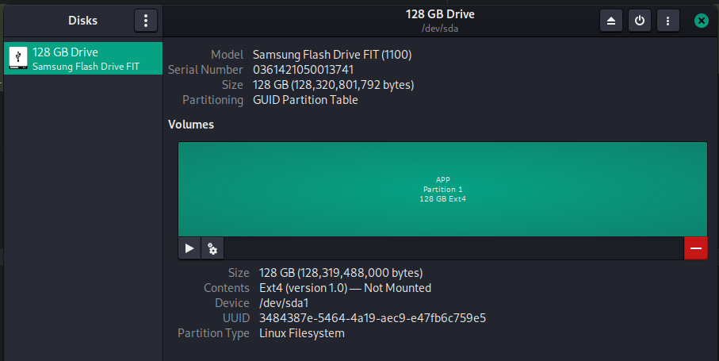
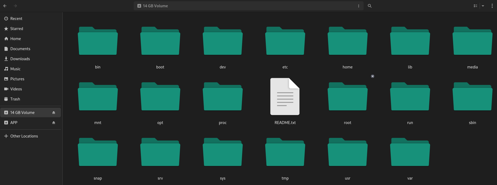

# Jetson Nano Boot from USB Headless Setup Guide

---

## Overview
This is guide is meant for the _Jetson Nano **A02**_ (additional info: [Nvidia Jetson Nano Developer Kit A02 vs B01 vs 2GB](https://tutorial.cytron.io/2020/10/14/nvidia-jetson-nano-developer-kit-a02-vs-b01-vs-2gb)) and assumes that the user has previously installed at least version **4.5.1** JetPack with the previously more common SD Card method (Link: [Getting Started with Jetson Nano Developer Kit](https://developer.nvidia.com/embedded/learn/get-started-jetson-nano-devkit)).  
The idea here is that the Jetson's operating system will be installed to a USB flash drive instead of a SD card.  

### Source Material
The instructions here are mainly based off of information from

| Title                                 | Link                                                                                              |
|---------------------------------------|---------------------------------------------------------------------------------------------------|
| NVIDIA Official Developer Forum Topic | [Boot from external drive](https://forums.developer.nvidia.com/t/boot-from-external-drive/182883) |
| JetsonHacks Blog                      | [Jetson Nano – Boot from USB](https://jetsonhacks.com/2021/03/10/jetson-nano-boot-from-usb)       |

## Pre-Boot Tasks

### Download and Extract Image
The link for the SD card image that will be used with the flash drive can be found on NVIDIA's Developer Downloads section at https://developer.nvidia.com/embedded/downloads#?tx=$product,jetson_nano or from https://developer.nvidia.com/jetson-nano-sd-card-image.  
Please be aware that as of this writing the OS image file in the above link is for JetPack version **4.6.1** which is _not the latest_, therefore the user will have to manually upgrade via changing the APT source file.

Once the file has finished downloading verify that the MD5 checksum matches what's on the website
```shell
$ md5sum jetson-nano-jp461-sd-card-image.zip
762653fb8798924d3b015acddcd03a53  jetson-nano-jp461-sd-card-image.zip 
```


Afterwards, extract the zip file, which will yield a single ~13 GB file named `sd-blob-b01.img`.
```shell
$ unzip jetson-nano-jp461-sd-card-image.zip
Archive:  jetson-nano-jp461-sd-card-image.zip
  inflating: sd-blob-b01.img
$ ls -lh | grep sd-blob
-rw-r--r-- 1 user user   13G Feb 22  2022 sd-blob-b01.img
```

### Prepare USB Flash Drive
NOTE: In this example, _GNOME Disks_ will be used for this

Format the flash drive of your choosing



Partition the drive, _Ext4_ will be used here and make sure to set the volume label to **APP**



Once ready, verify that everything worked correctly and you're able to access the drive



### Copy contents of the image

Now you must copy the contents of the image file to the new created partition on the flash drive

First, the image file must be mounted in order to access its contents, here GNOME's built-in Nautilus file system will be used for this



Using `rsync` (or whatever application you might prefer) copy the contents of the image with the exception of the `proc` directory  
In the example presented here the location of the mounted image is under `/run/media/user/66181078-3393-4d65-bae1-8e21a434c5b5` and the USB flash drive is mounted at `/run/media/user/APP`

```shell
$ cd /run/media/user/66181078-3393-4d65-bae1-8e21a434c5b5
$ sudo rsync -axHAWX --numeric-ids --info=progress2 --exclude=/proc . /run/media/user/APP
 12,137,190,396  95%   14.50MB/s    0:13:18 (xfr#127958, to-chk=0/186651)
```

The explanation of the `rsync` flags are as follows:  
Source: [rsync(1) - Linux man page](https://linux.die.net/man/1/rsync)

| Flag | Description                  |
|------|------------------------------|
| a    | archive mode                 |
| x    | don't cross fs boundaries    |
| H    | preserve hard links          |
| A    | preserve ACLs                |
| W    | copy whole files             |
| X    | preserve extended attributes |

Additional flags:

| Flag           | Description                                                                           |
|----------------|---------------------------------------------------------------------------------------|
| numeric-ids    | don't map uid/gid values by user/group name                                           |
| info=progress2 | prints total transfer progress as opposed to per-file transfer progress (`progress1`) |
| exclude=/proc  | exclude `proc` directory                                                              |

Once all of the files have been copied, verify that they're present on the device

```shell
$ cd /run/media/user/APP
$ ll
total 100K
drwxr-xr-x   2 root root 4.0K Jan 26  2022 bin/
drwxr-xr-x   4 root root 4.0K Feb 22  2022 boot/
drwxr-xr-x   2 root root 4.0K Feb 22  2022 dev/
drwxr-xr-x 145 root root  12K Feb 22  2022 etc/
drwxr-xr-x   2 root root 4.0K Apr 24  2018 home/
drwxr-xr-x  21 root root 4.0K Feb 22  2022 lib/
drwx------   2 root root  16K Feb 22  2022 lost+found/
drwxr-xr-x   2 root root 4.0K Aug  6  2018 media/
drwxr-xr-x   2 root root 4.0K Apr 26  2018 mnt/
drwxr-xr-x   4 root root 4.0K Feb 22  2022 opt/
-rw-rw-rw-   1 root root   62 Feb 19  2022 README.txt
drwx------   6 root root 4.0K Feb 22  2022 root/
drwxr-xr-x  17 root root 4.0K Sep 29  2021 run/
drwxr-xr-x   2 root root 4.0K Jan 26  2022 sbin/
drwxr-xr-x   2 root root 4.0K May 11  2018 snap/
drwxr-xr-x   2 root root 4.0K Apr 26  2018 srv/
drwxr-xr-x   2 root root 4.0K Apr 24  2018 sys/
drwxrwxrwt   2 root root 4.0K Feb 22  2022 tmp/
drwxr-xr-x  12 root root 4.0K Feb 22  2022 usr/
drwxr-xr-x  19 root root 4.0K Feb 22  2022 var/
```
### Modify boot-up script

Next, it will be necessary to modify the `boot/extlinux/extlinux.conf` on the flash drive, so that it would boot from the right location.

Before that, it will be necessary to get the UUID of the partition itself.  
This can be done with the following script, assuming that the partition on the drive was assigned the device path of `/dev/sda1`.

```shell
$ sudo blkid -o value -s PARTUUID /dev/sda1
13b77335-df7b-47e3-9c94-225ea1ddf27f
```
Afterwards, using an editor, modify the entry in the boot-up file with the corresponding value from above

```shell
$ sudo vim /run/media/user/APP/boot/extlinux/extlinux.conf

TIMEOUT 30
DEFAULT primary

MENU TITLE L4T boot options

LABEL primary
      MENU LABEL primary kernel
      LINUX /boot/Image
      INITRD /boot/initrd
#      APPEND ${cbootargs} quiet root=/dev/mmcblk0p1 rw rootwait rootfstype=ext4 console=ttyS0,115200n8 console=tty0 fbcon=map:0 net.ifnames=0
      APPEND root=PARTUUID=13b77335-df7b-47e3-9c94-225ea1ddf27f rootwait rootfstype=ext4

# When testing a custom kernel, it is recommended that you create a backup of
# the original kernel and add a new entry to this file so that the device can
# fallback to the original kernel. To do this:
#
# 1, Make a backup of the original kernel
#      sudo cp /boot/Image /boot/Image.backup
#
# 2, Copy your custom kernel into /boot/Image
#
# 3, Uncomment below menu setting lines for the original kernel
#
# 4, Reboot

# LABEL backup
#    MENU LABEL backup kernel
#    LINUX /boot/Image.backup
#    INITRD /boot/initrd
#    APPEND ${cbootargs}
```

## Boot to OS

Now that you have prepared the flash drive, go ahead and plug it into one of the USB ports on the Nano and connect your computer with the Nano's microUSB port.  
The app used for accessing the Nano through USB cable is `screen`, but any other app that's capable of TTY communication can be used.

```shell
$ sudo screen /dev/ttyACM0 115200

System Configuration
  ┌─────────────┤ License For Customer Use of NVIDIA Software ├──────────────┐
  │                                                                          │
  │ License For Customer Use of NVIDIA Software
  │
  │ IMPORTANT NOTICE -- READ CAREFULLY: This License For Customer Use of
  │ NVIDIA Software ("LICENSE") is the agreement which governs use of the
  │ software of NVIDIA Corporation and its subsidiaries ("NVIDIA")
  │ downloadable herefrom, including computer software and associated
  │ printed materials ("SOFTWARE").  By downloading, installing, copying,
  │ or otherwise using the SOFTWARE, you agree to be bound by the terms of
  │ this LICENSE.  If you do not agree to the terms of this LICENSE, do not
  │ download the SOFTWARE.
  │
  │ RECITALS
  │
  │ Use of NVIDIA's products requires three elements: the SOFTWARE, the
  │ hardware on a graphics controller board, and a personal computer. The
  │
  │                                  <Ok>
  │                                                                          │
  └──────────────────────────────────────────────────────────────────────────┘
```
Follow the on-screen instructions until the device finished with its initial setup and reboots

Try to access the Nano again via `screen` to make sure that you're able to log in and can use the OS

```shell
$ sudo screen /dev/ttyACM0 115200

nano-host login: nano-user                    
Password: 
Welcome to Ubuntu 18.04.6 LTS (GNU/Linux 4.9.253-tegra aarch64)

 * Documentation:  https://help.ubuntu.com
 * Management:     https://landscape.canonical.com
 * Support:        https://ubuntu.com/advantage
This system has been minimized by removing packages and content that are
not required on a system that users do not log into.

To restore this content, you can run the 'unminimize' command.

260 updates can be applied immediately.
248 of these updates are standard security updates.
To see these additional updates run: apt list --upgradable


The programs included with the Ubuntu system are free software;
the exact distribution terms for each program are described in the
individual files in /usr/share/doc/*/copyright.

Ubuntu comes with ABSOLUTELY NO WARRANTY, to the extent permitted by
applicable law.

To run a command as administrator (user "root"), use "sudo <command>".
See "man sudo_root" for details.

nano-user@nano-host:~$
```
### Install fan daemon

In order to have the fan that's hooked up to the Nano working correctly, it's recommended to install a daemon that automatically starts it when the OS boots.

```shell
$ git clone https://github.com/kooscode/fan-daemon.git
Cloning into 'fan-daemon'...
remote: Enumerating objects: 91, done.
remote: Total 91 (delta 0), reused 0 (delta 0), pack-reused 91
Unpacking objects: 100% (91/91), done.
$ cd fan-daemon
$ make -j4
test -d bin || mkdir -p bin
g++ src/fan-daemon.cpp -o bin/fan-daemon
$ sudo ./install.sh
setting to /usr/local/bin/fan-daemon/...
done
adding service to /lib/systemd/system/...
done
starting and enabling service...
Created symlink /etc/systemd/system/multi-user.target.wants/fan-daemon.service → /lib/systemd/system/fan-daemon.service.
done
fan-daemon installed sucessfully!
```
If it was successful, then the fan should start working within 1-2 minutes approximately

### Setup and login through SSH

Create the `.ssh` and authorized_keys files, then set the permissions

```shell
$ mkdir .ssh
$ chmod 700 .ssh
$ cd .ssh
$ touch authorized_keys
$ chmod 644 authorized_keys
```

Add your public key to the `authorized_keys` file and then connect through SSH so that you won't have to use `screen` anymore.

### Install Wi-Fi

**IMPORTANT** Do not update the OS yet! First install the Wi-Fi drivers

```shell
$ sudo apt update
$ sudo apt install apt-utils
```

Reboot

```shell
$ sudo add-apt-repository ppa:canonical-hwe-team/backport-iwlwifi
$ sudo apt update
$ sudo apt install backport-iwlwifi-dkms
```

Reboot again and verify that the wireless network card is correctly detected by the OS

```shell
$ nmcli device show

...
GENERAL.DEVICE:                         wlp1s0
GENERAL.TYPE:                           wifi
GENERAL.HWADDR:                         5C:80:B6:58:65:F1
GENERAL.MTU:                            1500
GENERAL.STATE:                          30 (disconnected)
GENERAL.CONNECTION:                     --
GENERAL.CON-PATH:                       --
...
```

Connect to the network and enable auto-connect

```shell
$ nmcli device wifi list
IN-USE  SSID                MODE   CHAN  RATE        SIGNAL  BARS  SECURITY
        Some-Network-1  Infra  3     130 Mbit/s  69      ▂▄▆_  WPA1 WPA2
        Some-Network-2  Infra  36    270 Mbit/s  59      ▂▄▆_  WPA2
        Some-Network-3  Infra  9     270 Mbit/s  55      ▂▄__  WPA1 WPA2
        Some-Network-4  Infra  9     130 Mbit/s  52      ▂▄__  WPA1 WPA2
        Some-Network-5  Infra  11    130 Mbit/s  50      ▂▄__  WPA1 WPA2
$ sudo nmcli device wifi connect Some-Network-1 --ask
Password:
Device 'wlp1s0' successfully activated with 'something-something-some-hash'.
$ sudo nmcli connection modify Some-Network-1 connection.autoconnect yes
```

Modify Network Manager configuration file so that connection would be stable

```shell
$ sudo vim /etc/NetworkManager/NetworkManager.conf

[main]
... <-- Something here and then following line must be added below
dhcp=dhclient
...
```

Now the Nano should automatically connect to the previously specified wireless network

### Update the OS

Since the Wi-Fi backports don't work with versions `32.7.2` & `32.7.3`, it's advised to have some packages held back
```shell
$ sudo apt-mark hold nvidia-l4t-core nvidia-l4t-firmware nvidia-l4t-kernel
```

Next it's time to update the operating system with the latest packages

```shell
$ sudo apt update
$ sudo apt upgrade
```
As of the time of this writing, this will install to the latest _point release_ from 32.7.1 to 32.7.3  
`4.9.299-tegra-32.7.3-20221122092935` over `4.9.253-tegra-32.7.1-20220219090432`

### Resolve errors to updates (only if you update to 32.7.3)

It's highly likely that there will be some errors with the update which case you should follow the instructions from [Solution : dpkg: error processing package nvidia-l4t-bootloader –configure)](https://forums.developer.nvidia.com/t/solution-dpkg-error-processing-package-nvidia-l4t-bootloader-configure/208627)

```shell
$ sudo apt upgrade 
Reading package lists... Done
Building dependency tree       
Reading state information... Done
Calculating upgrade... Done
The following packages have been kept back:
  tensorrt
0 upgraded, 0 newly installed, 0 to remove and 1 not upgraded.
3 not fully installed or removed.
After this operation, 0 B of additional disk space will be used.
Do you want to continue? [Y/n] Y
Setting up nvidia-l4t-bootloader (32.7.3-20221122092935) ...
3448-200-0000--1--jetson-nano-devkit-
Starting bootloader post-install procedure.
ERROR. Procedure for bootloader update FAILED.
Cannot install package. Exiting...
dpkg: error processing package nvidia-l4t-bootloader (--configure):
 installed nvidia-l4t-bootloader package post-installation script subprocess returned error exit status 1
Setting up nvidia-l4t-xusb-firmware (32.7.3-20221122092935) ...
3448-200-0000--1--jetson-nano-devkit-
Starting xusb firmware post-install procedure.
ERROR. Procedure for xusb firmware update FAILED.
Cannot install package. Exiting...
dpkg: error processing package nvidia-l4t-xusb-firmware (--configure):
 installed nvidia-l4t-xusb-firmware package post-installation script subprocess returned error exit status 1
dpkg: dependency problems prevent configuration of nvidia-l4t-initrd:
 nvidia-l4t-initrd depends on nvidia-l4t-xusb-firmware (= 32.7.3-20221122092935); however:
  Package nvidia-l4t-xusb-firmware is not configured yet.

dpkg: error processing package nvidia-l4t-initrd (--configure):
 dependency problems - leaving unconfigured
No apport report written because the error message indicates its a followup error from a previous failure.
                                                                                                          Errors were encountered while processing:
 nvidia-l4t-bootloader
 nvidia-l4t-xusb-firmware
 nvidia-l4t-initrd
E: Sub-process /usr/bin/dpkg returned an error code (1)
```
### Enable SPI

```shell
$ sudo modprobe spidev
$ ls -l /dev | grep spidev
$ sudo vim /etc/modules-load.d/spidev.conf

spidev

$ sudo reboot
$ ls -l /dev | grep spidev
```